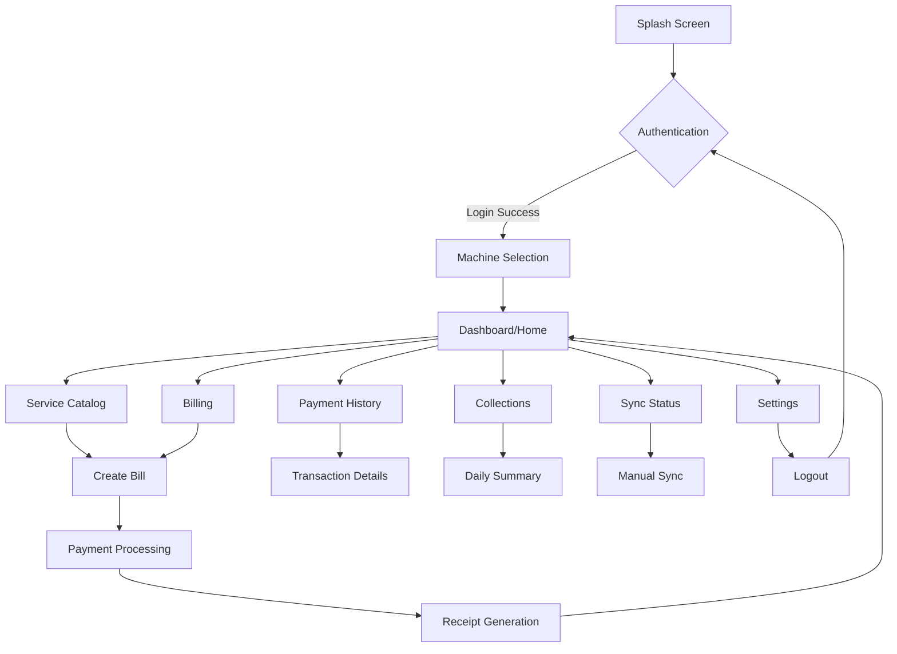

# Client App - Complete Specification & Workflow

## 📱 Project Overview

**App Name:** Billing Client App (Flutter Mobile Application)

**Purpose:** A mobile point-of-sale (POS) application for operators to manage billing, services, and payments at physical kiosks/machines. This app works in conjunction with the admin web dashboard to provide a complete billing management ecosystem.

**Target Platform:** Android & iOS (Flutter)

**Target Users:** Operators, Managers, Field Staff

---

## 🎯 Core Concept

The client app is a **mobile POS terminal** that allows operators to:
- Select services/products from a catalog
- Generate bills for customers
- Process payments (UPI, Card, Cash)
- Sync data with the central server
- Work offline when internet is unavailable
- Track daily collections and transactions

---

## 🏗️ App Architecture



---

## 📋 Complete Feature List

### 1. **Authentication & Authorization**

#### Login Screen
- **Username/Password** authentication
- **Remember Me** functionality
- **Biometric login** (fingerprint/face ID) after first login
- **Offline login** capability (cached credentials)
- Role-based access (Operator, Manager, Admin)
- Auto-logout after inactivity (configurable timeout)

#### Features:
```dart
- Email/Username field
- Password field with show/hide toggle
- "Remember Me" checkbox
- "Forgot Password" link
- Biometric authentication toggle
- Login button with loading state
- Error handling and validation
```

---

### 2. **Machine Selection**

After login, operators select which machine/kiosk they're operating.

#### Features:
- **List of assigned machines** (based on user role)
- **Machine status indicator** (Online/Offline/Maintenance)
- **Last sync timestamp**
- **Quick stats** (today's collection, pending sync)
- **Search/filter** machines
- **Favorite machines** (quick access)

#### Machine Card Display:
```
┌─────────────────────────────────┐
│ 🏪 Main Entrance POS            │
│ 📍 Lobby A                      │
│ 🟢 Online • Synced 2 mins ago   │
│ ─────────────────────────────   │
│ Today: ₹12,500 | Pending: 3     │
└─────────────────────────────────┘
```

---

### 3. **Dashboard/Home Screen**

The main hub after machine selection.

#### Top Section:
- **Machine name & location**
- **Status indicator** (Online/Offline)
- **Last sync time**
- **Sync button** (manual sync)

#### Quick Stats Cards:
```
┌──────────────┬──────────────┬──────────────┐
│ Today's Sale │ Transactions │ Pending Sync │
│   ₹12,500    │      45      │      3       │
└──────────────┴──────────────┴──────────────┘
```

#### Main Actions:
- **New Bill** (primary action button - FAB)
- **Service Catalog**
- **Payment History**
- **Collections Report**
- **Sync Status**
- **Settings**

#### Recent Transactions:
- Last 5-10 transactions
- Quick view of bill number, amount, time
- Tap to view details

---

### 4. **Service Catalog**

Browse and manage available services/products.

#### Features:
- **Grid/List view** toggle
- **Search** services
- **Filter** by status (Active/Inactive)
- **Sort** by name, price
- **Service cards** with:
  - Service name
  - Price
  - Status badge
  - Quick add to cart button

#### Service Card:
```
┌─────────────────────────────────┐
│ Standard Parking                │
│ ₹50.00                          │
│ [Active] 🟢                     │
│           [+ Add to Cart]       │
└─────────────────────────────────┘
```

#### Manager Features:
- **Add new service**
- **Edit service** (name, price)
- **Activate/Deactivate** service
- **View service history**

---

### 5. **Billing/Cart Screen**

Create and manage customer bills.

#### Cart Interface:
```
┌─────────────────────────────────────┐
│ CART                                │
├─────────────────────────────────────┤
│ Standard Parking    ₹50  [- 1 +] ❌ │
│ Premium Valet      ₹150  [- 1 +] ❌ │
│ Coffee              ₹80  [- 2 +] ❌ │
├─────────────────────────────────────┤
│ Subtotal:                    ₹330   │
│ Tax (if applicable):          ₹0    │
│ Discount:                     ₹0    │
├─────────────────────────────────────┤
│ TOTAL:                       ₹330   │
└─────────────────────────────────────┘
```

#### Features:
- **Add services** from catalog
- **Quantity adjustment** (+/- buttons)
- **Remove items** from cart
- **Apply discount** (percentage or fixed amount)
- **Add notes/remarks**
- **Customer details** (optional: name, phone)
- **Clear cart** button
- **Proceed to payment** button

#### Discount Options:
- Percentage discount (10%, 20%, etc.)
- Fixed amount discount
- Coupon code application
- Manager approval for large discounts

---

### 6. **Payment Processing**

Handle multiple payment methods.

#### Payment Methods:
1. **UPI**
   - QR code generation
   - UPI ID input
   - Payment verification
   - Auto-detect payment status

2. **Card**
   - Card swipe/tap integration
   - Manual card entry (if needed)
   - Transaction ID capture

3. **Cash**
   - Amount tendered input
   - Change calculation
   - Cash drawer integration (optional)

4. **Split Payment**
   - Multiple payment methods for one bill
   - Partial payments

#### Payment Flow:
```
Select Method → Enter Amount → Process → Confirm → Generate Receipt
```

#### Features:
- **Payment method selection** (tabs/buttons)
- **Amount display** (large, clear)
- **Payment status** (Processing/Success/Failed)
- **Retry mechanism** for failed payments
- **Cancel payment** option
- **Print receipt** option
- **Email/SMS receipt** option
- **Share receipt** (WhatsApp, etc.)

---

### 7. **Receipt Generation**

Digital and printable receipts.

#### Receipt Format:
```
═══════════════════════════════════
        BILLING RECEIPT
═══════════════════════════════════
Machine: Main Entrance POS
Location: Lobby A
Date: 04 Feb 2026, 2:30 PM
Bill #: TXN-12345
───────────────────────────────────
ITEMS:
Standard Parking    x1      ₹50.00
Premium Valet       x1     ₹150.00
Coffee              x2     ₹160.00
───────────────────────────────────
Subtotal:                   ₹360.00
Discount:                    ₹30.00
───────────────────────────────────
TOTAL:                      ₹330.00
───────────────────────────────────
Payment Method: UPI
Status: SUCCESS
───────────────────────────────────
Thank you for your business!
═══════════════════════════════════
```

#### Features:
- **PDF generation**
- **Thermal printer support**
- **Share options** (WhatsApp, Email, SMS)
- **Save to gallery**
- **Reprint** previous receipts
- **Custom branding** (logo, business details)

---

### 8. **Payment History**

View all transactions.

#### Features:
- **List of all payments**
- **Filter by**:
  - Date range (Today, Yesterday, Last 7 days, Custom)
  - Payment method (UPI, Card, Cash)
  - Payment status (Success, Pending, Failed)
  - Amount range
- **Search** by bill number, customer name
- **Sort** by date, amount
- **Export** to CSV/PDF
- **View details** (tap on transaction)

#### Transaction List Item:
```
┌─────────────────────────────────────┐
│ TXN-12345              ₹330.00      │
│ 04 Feb 2026, 2:30 PM                │
│ UPI • SUCCESS 🟢                    │
└─────────────────────────────────────┘
```

#### Transaction Details:
- Full receipt view
- Payment breakdown
- Customer details
- Reprint option
- Refund option (manager only)

---

### 9. **Collections Report**

Daily/periodic collection summary.

#### Features:
- **Date range selector**
- **Total collections** (online + offline)
- **Breakdown by payment method**:
  - UPI: ₹X
  - Card: ₹Y
  - Cash: ₹Z
- **Transaction count**
- **Average transaction value**
- **Hourly breakdown** (chart)
- **Export report** (PDF/CSV)

#### Visual Charts:
- **Pie chart**: Payment method distribution
- **Line chart**: Hourly sales trend
- **Bar chart**: Daily comparison

#### Summary Card:
```
┌─────────────────────────────────────┐
│ TODAY'S COLLECTION                  │
├─────────────────────────────────────┤
│ Total:              ₹12,500         │
│ Transactions:            45         │
│ Average:              ₹278          │
├─────────────────────────────────────┤
│ UPI:     ₹7,500 (60%)               │
│ Card:    ₹3,000 (24%)               │
│ Cash:    ₹2,000 (16%)               │
└─────────────────────────────────────┘
```

---

### 10. **Sync Management**

Handle online/offline data synchronization.

#### Features:
- **Auto-sync** (configurable interval)
- **Manual sync** button
- **Sync status indicator**:
  - ✅ Synced
  - 🔄 Syncing...
  - ⏳ Pending (X items)
  - ❌ Failed
- **Pending items count**
- **Last sync timestamp**
- **Sync history/log**
- **Conflict resolution** (if needed)

#### Sync Items:
- New payments
- Updated services
- Machine status
- Logs and history

#### Offline Mode:
- **Queue transactions** locally
- **Visual indicator** (offline badge)
- **Auto-sync** when connection restored
- **Data persistence** (local database)

---

### 11. **Settings**

App configuration and preferences.

#### Sections:

**Account**
- User profile
- Change password
- Logout

**Machine**
- Switch machine
- Machine details
- Refresh machine data

**Preferences**
- Language selection
- Theme (Light/Dark)
- Currency format
- Date/time format
- Receipt template

**Sync**
- Auto-sync toggle
- Sync interval
- WiFi-only sync
- Clear cache

**Printer**
- Printer selection
- Test print
- Printer settings

**Security**
- Biometric authentication toggle
- Auto-logout timeout
- PIN protection

**About**
- App version
- Terms & conditions
- Privacy policy
- Support/Help

---

## 🔄 Complete User Workflows

### Workflow 1: **Create a New Bill**

```
1. Tap "New Bill" FAB on dashboard
2. Browse/search services in catalog
3. Add services to cart (with quantities)
4. Review cart items
5. Apply discount (if needed)
6. Add customer details (optional)
7. Tap "Proceed to Payment"
8. Select payment method
9. Process payment
10. Confirm payment success
11. Generate receipt
12. Share/print receipt
13. Return to dashboard
```

### Workflow 2: **Daily Opening Routine**

```
1. Launch app
2. Login (biometric/password)
3. Select machine
4. Review yesterday's closing summary
5. Check pending sync items
6. Sync data with server
7. Verify service catalog is up-to-date
8. Start accepting customers
```

### Workflow 3: **Daily Closing Routine**

```
1. Stop accepting new customers
2. Review today's collections
3. Count physical cash
4. Reconcile cash with system
5. Generate end-of-day report
6. Sync all pending transactions
7. Export reports (if needed)
8. Logout
```

### Workflow 4: **Handling Failed Payment**

```
1. Payment fails during processing
2. Show error message
3. Offer retry option
4. If retry fails, offer alternative payment method
5. If all methods fail, save as pending transaction
6. Notify manager
7. Allow manual resolution later
```

### Workflow 5: **Offline Operation**

```
1. Internet connection lost
2. App shows "Offline Mode" indicator
3. Continue accepting payments (stored locally)
4. Queue all transactions for sync
5. Show pending sync count
6. When connection restored, auto-sync
7. Verify all transactions synced successfully
```

---

## 🎨 UI/UX Design Guidelines

### Design Principles:
1. **Speed First**: Minimize taps to complete a transaction
2. **Clarity**: Large, readable fonts and buttons
3. **Feedback**: Clear visual/audio feedback for actions
4. **Error Prevention**: Confirmation dialogs for critical actions
5. **Accessibility**: Support for different screen sizes and orientations

### Color Scheme:
- **Primary**: Blue (#2563EB) - Trust, professionalism
- **Success**: Green (#10B981) - Successful payments
- **Warning**: Orange (#F59E0B) - Pending actions
- **Error**: Red (#EF4444) - Failed transactions
- **Neutral**: Gray (#6B7280) - Secondary elements

### Typography:
- **Headers**: Bold, 24-28px
- **Body**: Regular, 16-18px
- **Amounts**: Bold, 32-48px (high visibility)
- **Labels**: Medium, 14px

### Components:
- **Bottom Navigation** (5 tabs max)
- **Floating Action Button** (New Bill)
- **Cards** for list items
- **Modal Sheets** for forms
- **Snackbars** for notifications
- **Loading Indicators** for async operations

---

## 🔐 Security Features

1. **Authentication**
   - Secure password storage (hashed)
   - Biometric authentication
   - Session management
   - Auto-logout on inactivity

2. **Data Security**
   - Encrypted local storage
   - Secure API communication (HTTPS)
   - Token-based authentication
   - Data encryption at rest

3. **Access Control**
   - Role-based permissions
   - Manager approval for sensitive actions
   - Audit logs for all transactions

4. **Payment Security**
   - PCI DSS compliance (if handling cards)
   - Secure payment gateway integration
   - Transaction verification
   - Fraud detection

---

## 📊 Data Management

### Local Storage (SQLite):
```
Tables:
- users (cached credentials)
- machines (assigned machines)
- services (catalog cache)
- payments (pending sync)
- sync_queue (pending operations)
- settings (app preferences)
```

### Sync Strategy:
- **Pull**: Fetch latest services, machine status
- **Push**: Upload new payments, logs
- **Conflict Resolution**: Server wins (for most cases)
- **Retry Logic**: Exponential backoff for failed syncs

---

## 🚀 Technical Stack

### Framework:
- **Flutter** (Dart)
- **Minimum SDK**: Android 21+ (Lollipop), iOS 12+

### State Management:
- **Provider** / **Riverpod** / **Bloc** (choose one)

### Local Database:
- **SQLite** (sqflite package)
- **Hive** (for key-value storage)

### Networking:
- **Dio** (HTTP client)
- **Retrofit** (API abstraction)

### UI Components:
- **Material Design 3**
- **Custom widgets** for branding

### Payment Integration:
- **UPI**: Intent-based / Deep linking
- **Card**: Payment gateway SDK
- **Printer**: Bluetooth/USB printer libraries

### Other Packages:
- **flutter_secure_storage**: Secure credential storage
- **local_auth**: Biometric authentication
- **pdf**: Receipt generation
- **share_plus**: Share receipts
- **connectivity_plus**: Network status
- **intl**: Internationalization
- **fl_chart**: Charts and graphs

---

## 📱 Screen Breakdown

### 1. Splash Screen
- App logo
- Loading indicator
- Version number

### 2. Login Screen
- Username/email field
- Password field
- Remember me checkbox
- Biometric login button
- Forgot password link
- Login button

### 3. Machine Selection
- List/grid of machines
- Search bar
- Filter options
- Machine status badges

### 4. Dashboard
- Header (machine info, sync status)
- Quick stats cards
- Action buttons
- Recent transactions list
- Bottom navigation

### 5. Service Catalog
- Search bar
- Filter/sort options
- Grid/list toggle
- Service cards
- Add to cart buttons

### 6. Cart/Billing
- Cart items list
- Quantity controls
- Discount section
- Customer details form
- Total amount display
- Payment button

### 7. Payment
- Payment method tabs
- Amount display
- Payment form (method-specific)
- Process button
- Status indicator

### 8. Receipt
- Receipt preview
- Share buttons
- Print button
- Done button

### 9. Payment History
- Date filter
- Search bar
- Transaction list
- Filter chips
- Export button

### 10. Collections
- Date range picker
- Summary cards
- Charts
- Export button

### 11. Sync Status
- Sync button
- Status indicator
- Pending items list
- Sync log

### 12. Settings
- Grouped list items
- Toggle switches
- Navigation to sub-screens
- Logout button

---

## 🎯 Key Performance Indicators (KPIs)

### App Performance:
- **Launch time**: < 2 seconds
- **Transaction time**: < 10 seconds (from cart to receipt)
- **Sync time**: < 5 seconds for 100 transactions
- **Offline capability**: 1000+ transactions stored locally

### User Experience:
- **Taps to complete sale**: < 5 taps
- **Error rate**: < 1% failed transactions
- **Sync success rate**: > 99%
- **App crash rate**: < 0.1%

---

## 🔮 Future Enhancements

### Phase 2 Features:
1. **Inventory Management**
   - Stock tracking
   - Low stock alerts
   - Reorder notifications

2. **Customer Management**
   - Customer database
   - Loyalty program
   - Purchase history

3. **Analytics Dashboard**
   - Sales trends
   - Peak hours analysis
   - Product performance

4. **Multi-language Support**
   - Hindi, Tamil, Telugu, etc.
   - RTL language support

5. **Advanced Reporting**
   - Custom report builder
   - Scheduled reports
   - Email reports

6. **Hardware Integration**
   - Barcode scanner
   - Weighing scale
   - Cash drawer

7. **Voice Commands**
   - Voice-activated billing
   - Hands-free operation

8. **AI Features**
   - Smart recommendations
   - Fraud detection
   - Demand forecasting

---

## 📝 Development Prompt

### Complete Implementation Prompt:

```
Create a Flutter mobile app for a billing/POS system with the following specifications:

**Core Features:**
1. User authentication (username/password + biometric)
2. Machine selection and management
3. Service catalog browsing
4. Shopping cart and billing
5. Multi-payment processing (UPI, Card, Cash)
6. Digital receipt generation and sharing
7. Payment history and filtering
8. Collections reporting with charts
9. Offline mode with auto-sync
10. Settings and preferences

**Technical Requirements:**
- Flutter SDK 3.x+
- Material Design 3
- State management: [Provider/Riverpod/Bloc]
- Local database: SQLite (sqflite)
- API integration: Supabase REST API
- Secure storage: flutter_secure_storage
- Biometric auth: local_auth
- PDF generation: pdf package
- Charts: fl_chart
- Network detection: connectivity_plus

**Database Schema:**
- Refer to DATABASE_SCHEMA.md for complete schema
- Tables: users, machines, services, payments, machine_logs, catalog_history

**API Endpoints:**
- Base URL: [Supabase Project URL]
- Authentication: JWT tokens
- Endpoints: /machines, /services, /payments, /sync

**UI/UX:**
- Bottom navigation (5 tabs)
- FAB for "New Bill"
- Card-based layouts
- Large, readable fonts for amounts
- Color-coded status indicators
- Smooth animations and transitions
- Responsive design (phones and tablets)

**Security:**
- Encrypted local storage
- HTTPS only
- Token-based auth
- Role-based access control
- Auto-logout after 15 mins inactivity

**Offline Support:**
- Queue transactions locally
- Auto-sync when online
- Conflict resolution (server wins)
- Visual offline indicator

**Payment Integration:**
- UPI: Intent-based deep linking
- Card: Payment gateway SDK integration
- Cash: Manual entry with change calculation
- Split payments supported

**Receipt Features:**
- PDF generation
- Thermal printer support (Bluetooth)
- Share via WhatsApp, Email, SMS
- Custom branding (logo, business details)

**Performance:**
- App launch < 2 seconds
- Transaction completion < 10 seconds
- Support 1000+ offline transactions
- Smooth 60fps animations

**Screens:**
1. Splash
2. Login
3. Machine Selection
4. Dashboard
5. Service Catalog
6. Cart/Billing
7. Payment Processing
8. Receipt
9. Payment History
10. Collections Report
11. Sync Status
12. Settings

**Deliverables:**
- Complete Flutter project
- Clean architecture (presentation, domain, data layers)
- Unit tests for business logic
- Widget tests for UI components
- README with setup instructions
- API documentation
- User manual
```

---

## 📞 Support & Documentation

### For Developers:
- API documentation: `/docs/api`
- Architecture guide: `/docs/architecture`
- Contributing guide: `/docs/contributing`

### For Users:
- User manual: `/docs/user-guide`
- FAQ: `/docs/faq`
- Video tutorials: `/docs/videos`
- Support email: support@billingadmin.com

---

## 📄 License & Credits

**License:** MIT / Proprietary (specify)

**Credits:**
- Design: [Designer Name]
- Development: [Developer Name]
- Icons: Material Icons / Custom
- Illustrations: [Source]

---

**Document Version:** 1.0  
**Last Updated:** 04 Feb 2026  
**Author:** Billing Admin Team
