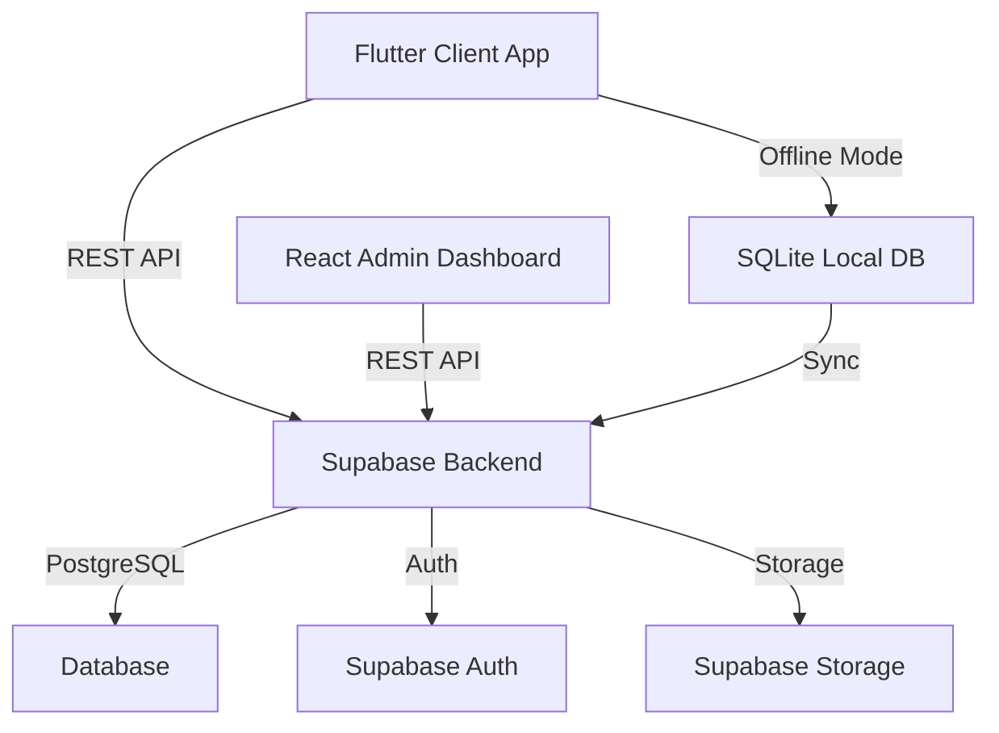

# BillKaro POS - Complete Project Documentation

## 📚 Documentation Index

This is your complete guide to the BillKaro POS system. All documentation files are organized below.

---

## 🗂️ Core Documentation Files

### 1. [Database Schema](file:///Users/nallanaharikrishna/PROJECTS/mit/admin/park-central/DATABASE_SCHEMA.md)
**Complete database structure with tables, relationships, and security**

- 6 core tables (users, machines, services, payments, machine_logs, catalog_history)
- Custom enum types
- Entity relationship diagrams
- Row Level Security (RLS) policies
- Indexes and triggers
- Sample data

---

### 2. [Client App Specification](file:///Users/nallanaharikrishna/PROJECTS/mit/CLIENT_APP_SPECIFICATION.md)
**Complete Flutter mobile app features and workflows**

- 11 major features
- 12 screen specifications
- 5 complete user workflows
- UI/UX guidelines
- Technical stack
- Performance KPIs
- Implementation prompt

---

### 3. [5-Phase Development Plan](file:///Users/nallanaharikrishna/PROJECTS/mit/5_PHASE_DEVELOPMENT_PLAN.md)
**Phased rollout strategy from MVP to Enterprise**

- **Phase 1:** MVP - Core Billing (4-6 weeks)
- **Phase 2:** Enhanced Operations (3-4 weeks)
- **Phase 3:** Analytics & Reporting (3-4 weeks)
- **Phase 4:** Advanced Features (4-5 weeks)
- **Phase 5:** Enterprise & Scale (4-6 weeks)

Each phase includes:
- Feature breakdown
- Database schema evolution
- API endpoints required
- Effort estimation

---

### 4. [API Specification](file:///Users/nallanaharikrishna/PROJECTS/mit/API_SPECIFICATION.md)
**Complete REST API documentation**

- 18 endpoints across 5 categories
- Request/response formats
- Authentication flows
- Error handling
- Usage examples
- RLS policies
- SQL functions

---

## 🎯 Quick Start Guide

### For Product Managers
1. Read [5-Phase Development Plan](file:///Users/nallanaharikrishna/PROJECTS/mit/5_PHASE_DEVELOPMENT_PLAN.md) - Understand the roadmap
2. Review [Client App Specification](file:///Users/nallanaharikrishna/PROJECTS/mit/CLIENT_APP_SPECIFICATION.md) - See all features

### For Developers
1. Study [Database Schema](file:///Users/nallanaharikrishna/PROJECTS/mit/admin/park-central/DATABASE_SCHEMA.md) - Understand data structure
2. Review [API Specification](file:///Users/nallanaharikrishna/PROJECTS/mit/API_SPECIFICATION.md) - Implement endpoints
3. Follow [5-Phase Development Plan](file:///Users/nallanaharikrishna/PROJECTS/mit/5_PHASE_DEVELOPMENT_PLAN.md) - Build incrementally

### For Designers
1. Review [Client App Specification](file:///Users/nallanaharikrishna/PROJECTS/mit/CLIENT_APP_SPECIFICATION.md) - UI/UX guidelines
2. Check screen specifications and workflows

---

## 📊 Project Overview

### System Architecture



### Technology Stack

**Client App (Flutter):**
- Flutter 3.x+
- Material Design 3
- SQLite (offline storage)
- Provider/Riverpod (state management)
- Dio (HTTP client)

**Admin Dashboard (React):**
- React + TypeScript
- Vite
- TailwindCSS
- Recharts (analytics)
- React Query

**Backend (Supabase):**
- PostgreSQL database
- Auto-generated REST API
- JWT authentication
- Row Level Security
- Real-time subscriptions

---

## 🗄️ Database Summary

### Tables (28 Total - All Phases)

**Phase 1 (MVP):**
- users
- machines
- services
- payments

**Phase 2:**
- machine_logs

**Phase 3:**
- catalog_history
- reports
- notifications

**Phase 4:**
- customers
- customer_transactions
- inventory
- inventory_movements
- refunds
- loyalty_rules
- split_payments

**Phase 5:**
- locations
- subscriptions
- employees
- shifts
- vendors
- purchase_orders
- purchase_order_items
- campaigns
- campaign_analytics
- api_keys
- webhooks
- webhook_logs
- ai_insights

---

## 🚀 API Endpoints Summary

### Phase 1 (MVP) - 8 Endpoints
```
POST   /auth/v1/token          # Login
POST   /auth/v1/logout         # Logout
GET    /auth/v1/user           # Get user
GET    /machines               # List machines
GET    /services               # List services
POST   /payments               # Create payment
GET    /payments               # List payments
PATCH  /machines               # Update machine
```

### Phase 2 - +3 Endpoints
```
POST   /services               # Create service
PATCH  /services               # Update service
DELETE /services               # Delete service
```

### Phase 3 - +1 Endpoint
```
GET    /rpc/get_collections_summary  # Analytics
```

### Phase 4 - +10 Endpoints
```
Customer, Inventory, Refund, Loyalty endpoints
```

### Phase 5 - +15 Endpoints
```
Multi-tenant, Subscription, Employee, Campaign endpoints
```

**Total: 37+ endpoints**

---

## 📱 Client App Features Summary

### Core Features (Phase 1)
- ✅ Username/password authentication
- ✅ Machine selection
- ✅ Service catalog browsing
- ✅ Shopping cart
- ✅ Cash payment processing
- ✅ Basic receipt generation
- ✅ Payment history
- ✅ Manual sync

### Enhanced Features (Phase 2)
- ✅ Biometric authentication
- ✅ Offline mode with auto-sync
- ✅ UPI & Card payments
- ✅ PDF receipts with sharing
- ✅ Discount application
- ✅ Collections report
- ✅ Settings & preferences

### Advanced Features (Phase 3+)
- ✅ Analytics charts
- ✅ Thermal printer support
- ✅ Customer management
- ✅ Loyalty program
- ✅ Inventory tracking
- ✅ Split payments
- ✅ Refunds & cancellations

---

## 🎨 Admin Dashboard Features

### Core Features
- Machine management (CRUD)
- Service management (CRUD)
- Payment overview
- User management
- Basic analytics dashboard

### Advanced Features
- Revenue charts & trends
- Machine performance comparison
- Custom report builder
- Bulk operations
- Activity logs
- Client management
- Inventory management
- Campaign management

---

## 📈 Development Timeline

### Recommended Approach (Startup)

**Phase 1 (MVP):** 6 weeks
- Week 1-2: Database setup + API
- Week 3-4: Client app core features
- Week 5-6: Admin dashboard + testing

**Phase 2 (Enhanced):** 4 weeks
- Week 1-2: Offline mode + multi-payment
- Week 3-4: PDF receipts + collections

**Phase 3 (Analytics):** 4 weeks
- Week 1-2: Charts + reports
- Week 3-4: Export + notifications

**Total MVP to Analytics:** 14 weeks (3.5 months)

### Full System (All Phases)

**Total Development Time:** 30 weeks (7.5 months)

**Team Recommendation:**
- 2 Flutter developers
- 1 React developer
- 1 Backend developer
- 1 UI/UX designer
- 1 QA engineer

---

## 🔐 Security Considerations

### Authentication
- JWT token-based auth
- Biometric login (client app)
- Session management
- Auto-logout on inactivity

### Data Security
- Row Level Security (RLS)
- Encrypted local storage
- HTTPS only
- Secure password hashing (bcrypt)

### Access Control
- Role-based permissions (admin, manager, operator)
- Granular RLS policies
- Audit logs

---

## 📊 Key Performance Indicators

### App Performance
- Launch time: < 2 seconds
- Transaction time: < 10 seconds
- Sync time: < 5 seconds (100 transactions)
- Offline capacity: 1000+ transactions

### Business Metrics
- Daily active users
- Transactions per day
- Average transaction value
- Payment method distribution
- Peak hours analysis

---

## 🛠️ Implementation Checklist

### Backend Setup
- [ ] Create Supabase project
- [ ] Run database schema migration
- [ ] Configure RLS policies
- [ ] Create SQL functions
- [ ] Test API endpoints
- [ ] Setup environment variables

### Client App Development
- [ ] Setup Flutter project
- [ ] Implement authentication
- [ ] Build machine selection
- [ ] Create service catalog
- [ ] Implement billing flow
- [ ] Add payment processing
- [ ] Generate receipts
- [ ] Implement offline mode
- [ ] Add sync functionality
- [ ] Create settings screen

### Admin Dashboard Development
- [ ] Setup React project
- [ ] Implement authentication
- [ ] Build dashboard
- [ ] Create machine management
- [ ] Create service management
- [ ] Build payment overview
- [ ] Add analytics charts
- [ ] Implement user management

### Testing
- [ ] Unit tests
- [ ] Integration tests
- [ ] E2E tests
- [ ] Performance testing
- [ ] Security audit
- [ ] User acceptance testing

### Deployment
- [ ] Setup CI/CD pipeline
- [ ] Configure production environment
- [ ] Deploy backend
- [ ] Deploy admin dashboard
- [ ] Publish client app (Play Store/App Store)
- [ ] Setup monitoring & logging

---

## 📞 Support & Resources

### Documentation
- Database Schema: Complete ✅
- API Specification: Complete ✅
- Client App Spec: Complete ✅
- Development Plan: Complete ✅

### External Resources
- [Supabase Documentation](https://supabase.com/docs)
- [Flutter Documentation](https://flutter.dev/docs)
- [React Documentation](https://react.dev)
- [Material Design Guidelines](https://m3.material.io)

---

## 🎯 Next Steps

1. **Review all documentation** - Ensure understanding
2. **Setup development environment** - Install tools
3. **Create Supabase project** - Get credentials
4. **Run database migration** - Setup schema
5. **Start Phase 1 development** - Build MVP
6. **Test thoroughly** - Ensure quality
7. **Deploy to production** - Launch!

---

## 📝 Document Versions

| Document | Version | Last Updated |
|----------|---------|--------------|
| Database Schema | 1.0 | 04 Feb 2026 |
| Client App Spec | 1.0 | 04 Feb 2026 |
| 5-Phase Plan | 1.0 | 04 Feb 2026 |
| API Specification | 1.0 | 04 Feb 2026 |
| Project README | 1.0 | 04 Feb 2026 |

---

**Project:** BillKaro POS  
**Status:** Documentation Complete ✅  
**Ready for Development:** Yes ✅  

---

*All documentation is complete and ready for implementation. Good luck with your development! 🚀*
