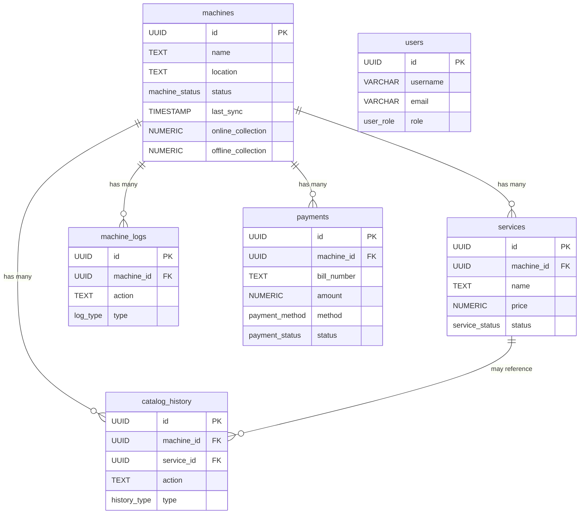

# Billing Admin System - Database Schema

## Overview

This document describes the complete database schema for the Billing Admin System built on Supabase (PostgreSQL).

## Custom Types (Enums)

| Enum Name | Values |
|-----------|--------|
| `machine_status` | `online`, `offline`, `maintenance` |
| `service_status` | `active`, `inactive` |
| `log_type` | `login`, `client`, `config`, `manager`, `system` |
| `history_type` | `update`, `create`, `delete`, `status` |
| `payment_method` | `UPI`, `Card`, `Cash` |
| `payment_status` | `success`, `pending`, `failed` |
| `user_role` | `admin`, `manager`, `operator` |

## Tables

### 1. `users`

Backend authentication and user management.

| Column | Type | Constraints | Description |
|--------|------|-------------|-------------|
| `id` | UUID | PRIMARY KEY, DEFAULT uuid_generate_v4() | Unique user identifier |
| `username` | VARCHAR(50) | UNIQUE, NOT NULL | Login username |
| `email` | VARCHAR(255) | UNIQUE, NOT NULL | User email address |
| `hashed_password` | VARCHAR(255) | NOT NULL | Bcrypt hashed password |
| `role` | user_role | DEFAULT 'operator', NOT NULL | User access level |
| `is_active` | VARCHAR(10) | DEFAULT 'true', NOT NULL | Account status |
| `created_at` | TIMESTAMP WITH TIME ZONE | DEFAULT NOW() | Creation timestamp |
| `updated_at` | TIMESTAMP WITH TIME ZONE | DEFAULT NOW() | Last update timestamp |

**Indexes:**
- `idx_users_username` on `username`
- `idx_users_email` on `email`

**Triggers:**
- `update_users_updated_at` - Auto-updates `updated_at` on row modification

---

### 2. `machines`

Physical machines/kiosks/POS terminals in the system.

| Column | Type | Constraints | Description |
|--------|------|-------------|-------------|
| `id` | UUID | PRIMARY KEY, DEFAULT uuid_generate_v4() | Unique machine identifier |
| `name` | TEXT | NOT NULL | Machine display name |
| `location` | TEXT | NOT NULL | Physical location |
| `status` | machine_status | DEFAULT 'offline' | Current operational status |
| `last_sync` | TIMESTAMP WITH TIME ZONE | DEFAULT NOW() | Last sync with server |
| `online_collection` | NUMERIC(10,2) | DEFAULT 0 | Online payment total |
| `offline_collection` | NUMERIC(10,2) | DEFAULT 0 | Offline payment total |
| `created_at` | TIMESTAMP WITH TIME ZONE | DEFAULT NOW() | Creation timestamp |
| `updated_at` | TIMESTAMP WITH TIME ZONE | DEFAULT NOW() | Last update timestamp |

**Triggers:**
- `update_machines_updated_at` - Auto-updates `updated_at` on row modification

---

### 3. `services`

Services/products offered by each machine.

| Column | Type | Constraints | Description |
|--------|------|-------------|-------------|
| `id` | UUID | PRIMARY KEY, DEFAULT uuid_generate_v4() | Unique service identifier |
| `machine_id` | UUID | NOT NULL, REFERENCES machines(id) ON DELETE CASCADE | Parent machine |
| `name` | TEXT | NOT NULL | Service/product name |
| `price` | NUMERIC(10,2) | NOT NULL | Service price |
| `status` | service_status | DEFAULT 'active' | Service availability |
| `created_at` | TIMESTAMP WITH TIME ZONE | DEFAULT NOW() | Creation timestamp |
| `updated_at` | TIMESTAMP WITH TIME ZONE | DEFAULT NOW() | Last update timestamp |

**Indexes:**
- `idx_services_machine_id` on `machine_id`

**Triggers:**
- `update_services_updated_at` - Auto-updates `updated_at` on row modification

---

### 4. `machine_logs`

Activity logs for machine operations.

| Column | Type | Constraints | Description |
|--------|------|-------------|-------------|
| `id` | UUID | PRIMARY KEY, DEFAULT uuid_generate_v4() | Unique log identifier |
| `machine_id` | UUID | NOT NULL, REFERENCES machines(id) ON DELETE CASCADE | Related machine |
| `action` | TEXT | NOT NULL | Action performed |
| `details` | TEXT | | Additional details |
| `type` | log_type | NOT NULL | Log category |
| `created_at` | TIMESTAMP WITH TIME ZONE | DEFAULT NOW() | Log timestamp |

**Indexes:**
- `idx_machine_logs_machine_id` on `machine_id`

---

### 5. `catalog_history`

Historical record of catalog/service changes.

| Column | Type | Constraints | Description |
|--------|------|-------------|-------------|
| `id` | UUID | PRIMARY KEY, DEFAULT uuid_generate_v4() | Unique history identifier |
| `machine_id` | UUID | NOT NULL, REFERENCES machines(id) ON DELETE CASCADE | Related machine |
| `service_id` | UUID | REFERENCES services(id) ON DELETE SET NULL | Related service (optional) |
| `action` | TEXT | NOT NULL | Action performed |
| `details` | TEXT | | Change details |
| `user_name` | TEXT | DEFAULT 'System' | User who made the change |
| `type` | history_type | NOT NULL | History category |
| `created_at` | TIMESTAMP WITH TIME ZONE | DEFAULT NOW() | History timestamp |

**Indexes:**
- `idx_catalog_history_machine_id` on `machine_id`

---

### 6. `payments`

Payment transaction records.

| Column | Type | Constraints | Description |
|--------|------|-------------|-------------|
| `id` | UUID | PRIMARY KEY, DEFAULT uuid_generate_v4() | Unique payment identifier |
| `machine_id` | UUID | NOT NULL, REFERENCES machines(id) ON DELETE CASCADE | Machine that processed payment |
| `bill_number` | TEXT | NOT NULL | Bill/transaction number |
| `amount` | NUMERIC(10,2) | NOT NULL | Payment amount |
| `method` | payment_method | NOT NULL | Payment method used |
| `status` | payment_status | DEFAULT 'success' | Payment status |
| `created_at` | TIMESTAMP WITH TIME ZONE | DEFAULT NOW() | Payment timestamp |

**Indexes:**
- `idx_payments_machine_id` on `machine_id`
- `idx_payments_created_at` on `created_at`

---

## Relationships



## Security

### Row Level Security (RLS)

RLS is enabled on all tables:
- `users`
- `machines`
- `services`
- `machine_logs`
- `catalog_history`
- `payments`

**Current Policies:** All tables have "Allow all access" policies (`USING (true)`). These should be customized based on your authentication requirements.

### Recommended Policy Updates

```sql
-- Example: Restrict users table to authenticated users
DROP POLICY "Allow all access to users" ON users;
CREATE POLICY "Users can view all users" ON users FOR SELECT USING (auth.role() = 'authenticated');
CREATE POLICY "Only admins can modify users" ON users FOR ALL USING (auth.jwt() ->> 'role' = 'admin');
```

## Database Functions

### `update_updated_at_column()`

Automatically updates the `updated_at` timestamp when a row is modified.

**Applied to:**
- `users`
- `machines`
- `services`

## Sample Data

The schema includes seed data for:
- 4 sample machines (Main Entrance POS, Cafeteria Kiosk, Parking Gate 1, Gift Shop)
- 7 services across machines
- 6 machine logs
- 3 catalog history entries
- 11 payment records (spanning today, yesterday, and last week)

## Schema File Location

The complete SQL schema is available at:
[`supabase/complete_schema.sql`](file:///Users/nallanaharikrishna/PROJECTS/mit/admin/park-central/supabase/complete_schema.sql)

## Verification

To verify all tables are created correctly, run:

```sql
SELECT 'users' as table_name, COUNT(*) as count FROM users
UNION ALL
SELECT 'machines', COUNT(*) FROM machines
UNION ALL
SELECT 'services', COUNT(*) FROM services
UNION ALL
SELECT 'machine_logs', COUNT(*) FROM machine_logs
UNION ALL
SELECT 'catalog_history', COUNT(*) FROM catalog_history
UNION ALL
SELECT 'payments', COUNT(*) FROM payments;
```
